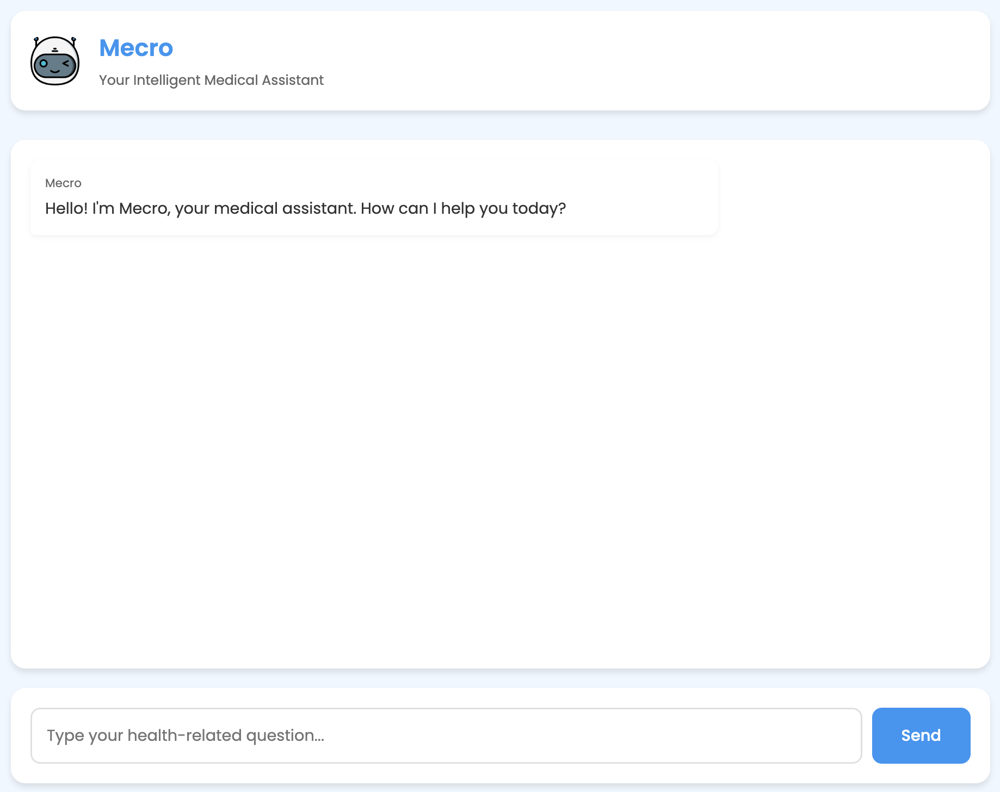

# Mecro Medical Assistant

**Your Intelligent AI-Powered Medical Assistant**

## Overview

Mecro is an AI-powered medical assistant designed to help users with various health-related tasks, including:

*   Extracting key patient details from conversations.
*   Making preliminary decisions based on user input and conversation history.
*   Ability to parse documents and answer questions based on the content of the documents.
*   Suggesting relevant doctors based on symptoms or requests.
*   Booking doctor appointments.
*   Sending appointment reminders via email.

Mecro utilizes an agentic architecture built with the FastMCP framework, enabling it to understand user needs, remember past interactions, make informed decisions, and perform actions through integrated tools.

## Demo 

Click to watch the demo video of below functionalities:-

1.  Extracting key patient details from conversations.
2.  Making preliminary decisions based on user input and conversation history.
3.  Suggesting relevant doctors based on symptoms or requests.
4.  Booking doctor appointments.
5.  Sending appointment reminders via email.
[](https://www.youtube.com/watch?v=OPs7lq_Skec)

Click to watch the demo video of parsing documents and answering questions based on the content of the documents.
[](https://drive.google.com/file/d/1bj88ziUj4PiZd4kl-yYrGFAx7QzVSMv0/view?usp=sharing)

## Project Structure

```
/
├── mcp_server.py           # Main server application using FastMCP
├── main.py                 # Main file to run the assistant
├── doc_processor.py        # File to process uploaded documents
├── mcp_client.py           # File to process user queries
├── index.html              # Frontend chat interface
├── layers/                 # Core cognitive layers of the agent
│   ├── perception.py       # Handles understanding and extracting information
│   ├── memory.py           # Stores and retrieves conversation history
│   ├── decision_making.py  # Makes choices based on context and memory
│   └── act.py              # Executes actions like suggesting doctors or booking
├── helpers/                # Utility functions and data models
│   ├── models.py           # Pydantic models for data structures (PatientDetails, Decision, etc.)
│   ├── gmail_tools.py      # Service for sending emails via Gmail API
│   └── config.py           # Configuration settings (if any)
├── data/                   # Placeholder for data files (like logos)
├── client_secret_...json   # Google Cloud Client Secret for Gmail API
├── app_tokens.json         # Google OAuth tokens (generated after first run)
└── README.md               # This file
```

## Agentic Architecture: Cognitive Layers

Mecro's intelligence is structured around several cognitive layers, mimicking human thought processes:

1.  **Perception (`layers/perception.py`)**
    *   **Role:** To understand and interpret the user's input.
    *   **Functionality:** Uses the `extract_patient_details` function (likely leveraging an LLM) to analyze the user's text and identify key information like patient name, symptoms, age, etc., structuring it into a `PatientDetails` model.
    *   **Tool:** Exposed as the `get_patient_details` tool in `mcp_server.py`.

2.  **Memory (`layers/memory.py`)**
    *   **Role:** To store and recall past interactions, providing context for decisions and actions.
    *   **Functionality:** The `Memory` class maintains a history of the conversation, including extracted patient details, decisions made, suggestions provided, and actions taken. It has `add_interaction` and `recall` methods.
    *   **Usage:** The memory instance is passed to the Decision Making and Action layers to inform their processes.

3.  **Decision Making (`layers/decision_making.py`)**
    *   **Role:** To analyze the current situation (user input + memory) and decide the next step or strategy.
    *   **Functionality:** The `DecisionMaker` class (likely using an LLM) evaluates the user's request and the conversation history (`memory.recall()`) to determine the most appropriate course of action (e.g., gather more info, suggest doctors, book appointment). It returns a `Decision` model.
    *   **Tool:** Exposed as the `make_decision` tool in `mcp_server.py`.

4.  **Action (`layers/act.py`)**
    *   **Role:** To execute tasks based on the decisions made.
    *   **Functionality:** The `Action` class contains methods to perform specific tasks:
        *   `get_doctors`: Suggests doctors based on input and memory (likely interacts with a doctor database or API).
        *   `book_doctor_appointment`: Handles the process of booking an appointment.
    *   **Tools:** Exposed as `suggest_doctors` and `book_appointment` tools in `mcp_server.py`.
    *   **External Integration:** Also includes functionality to interact with external services like Gmail via `helpers/gmail_tools.py` for sending reminders (exposed as the `send_reminder` tool).

## How it Works

1.  User sends a message via the `index.html` frontend.
2.  The message is sent to the `/chat` endpoint on the backend (`mcp_server.py` running via FastMCP).
3.  FastMCP routes the request, potentially invoking one or more tools (`get_patient_details`, `make_decision`, `suggest_doctors`, `book_appointment`, `send_reminder`) based on the conversation flow.
4.  **Perception:** `get_patient_details` extracts information.
5.  **Memory:** All interactions (user input, tool outputs) are stored.
6.  **Decision Making:** `make_decision` uses input and memory to choose the next step.
7.  **Action:** Tools like `suggest_doctors` or `book_appointment` are called based on the decision, using memory for context.
8.  The final response (or action result) is sent back to the frontend and displayed to the user.

## Running the Assistant

1.  **Run the Backend Server:**
    *   **For Development (with debug prints enabled):**
        ```bash
        python mcp_server.py dev
        ```
    *   **For Standard Operation:**
        ```bash
        python mcp_server.py
        ```
    *   **First Run Authentication:** The first time you run the server, it will likely open a browser window asking you to authenticate with Google for Gmail access. After successful authentication, an `app_tokens.json` file will be created.

2.  **Access the Frontend:**
    *   Open the `index.html` file in your web browser.
    *   The chat interface will connect to the backend server running on `http://localhost:8000` (assuming default FastMCP dev server port).

3.  **Interact:**
    *   Start chatting with Mecro in the web interface.
